<div align="center">

# ⚡ ContentForge AI

**A multi-agent AI system that turns one topic into a researched, SEO-optimized blog post with images, social posts, and a published Dev.to article.**

[](https://contentforge-ai.streamlit.app/)
[](https://youtu.be/HGx3S3wPGvY)
[](mailto:deepanshuagarwal946@gmail.com)


</div>

---

## 🎬 Watch the demo

[](https://youtu.be/HGx3S3wPGvY)

*2½ minutes: I type one topic, and the system researches it, studies competing articles, plans and writes the blog post, creates images, scores its SEO, writes LinkedIn and Twitter/X posts, and publishes the article live on Dev.to.*

---

## 💡 What it does, in plain English

A good blog post usually takes a whole content team: a researcher, an SEO specialist, a writer, a designer, and a social media manager. **ContentForge AI does each of those jobs with a separate AI agent**, and the agents pass their work to each other the way a real team would:

| Step | Agent | What it produces |
|---|---|---|
| 1 | **Router** | Decides if the topic needs fresh web research (news, prices, "latest") or can be written from general knowledge |
| 2 | **Researcher** | Searches the web (Tavily), filters out weak sources, and keeps dated, cited evidence |
| 3 | **Competitor Analyst** | Studies what already-ranking articles cover, and what they do well and badly |
| 4 | **Content-Gap Finder** | Lists what readers expect, what competitors *missed*, and fresh angles to take |
| 5 | **SEO Strategist** | Picks primary and secondary keywords, search intent, audience, and headings |
| 6 | **Orchestrator** | Writes the outline: sections, goals, word targets, and which sections need citations |
| 7 | **Writers (in parallel)** | One writer agent per section, all running at once for speed |
| 8 | **Image Planner + Generator** | Decides where diagrams help, then generates them with Google Gemini |
| 9 | **SEO Auditor** | Scores the final article, writes the meta description and slug, and adds an FAQ |
| 10 | **Repurposer** | Turns the blog into a LinkedIn post, a Twitter/X thread, a newsletter, or an Instagram carousel |
| 11 | **Publisher** | Picks valid tags and publishes the article to Dev.to in one click |

**Result from the demo:** the topic *"TMT bars in construction"* became a **2,434-word article with 10 research sources, 3 generated images, and an SEO score of 85/100**, published live on Dev.to.

---

## 📸 Screenshots

| | |
|---|---|
| **Strategy dashboard**<br>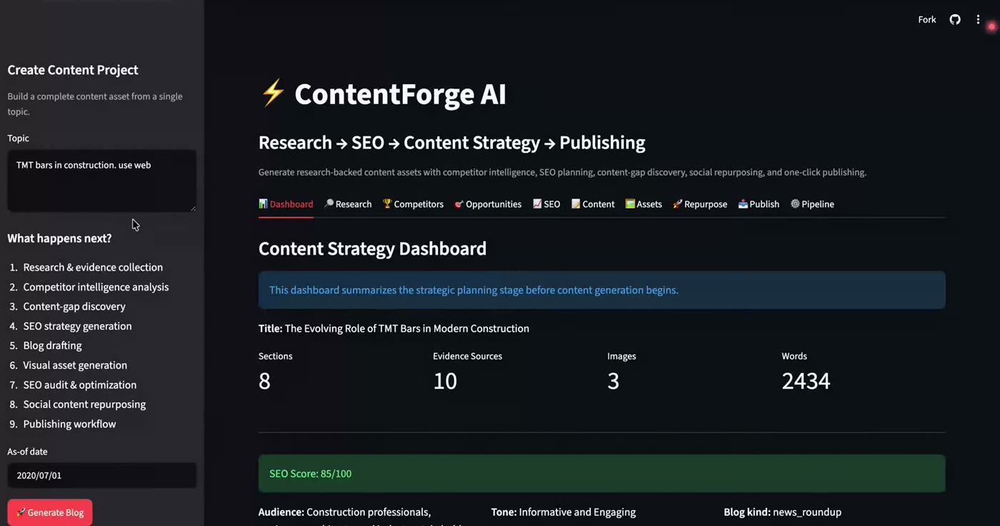 | **Web research with sources**<br>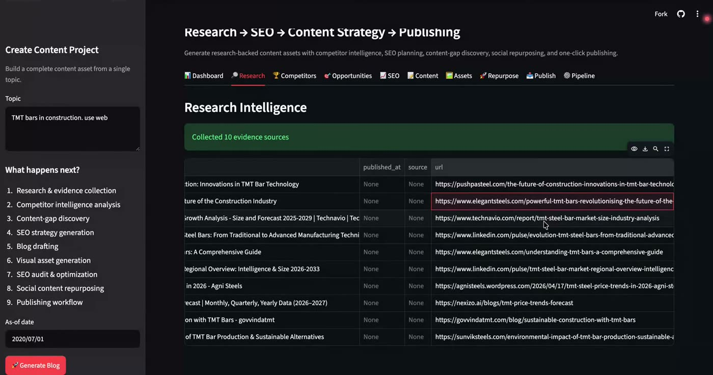 |
| **Competitor intelligence**<br>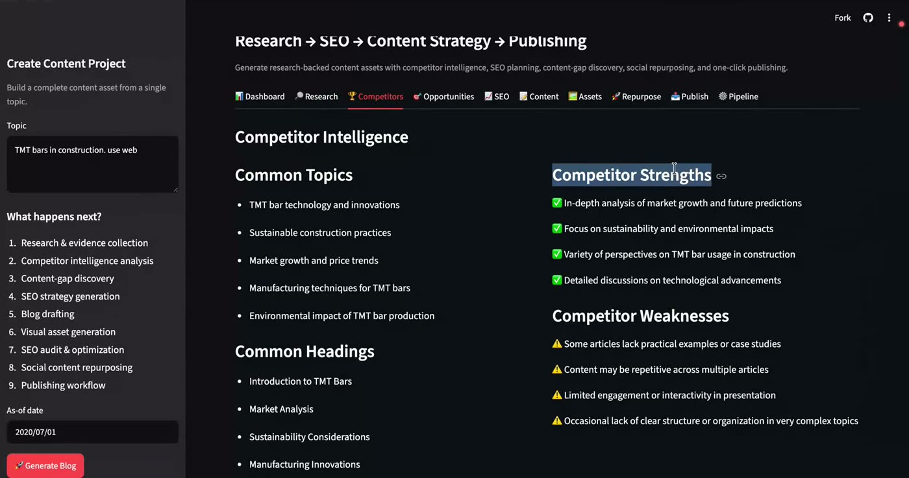 | **Content gaps and unique angles**<br>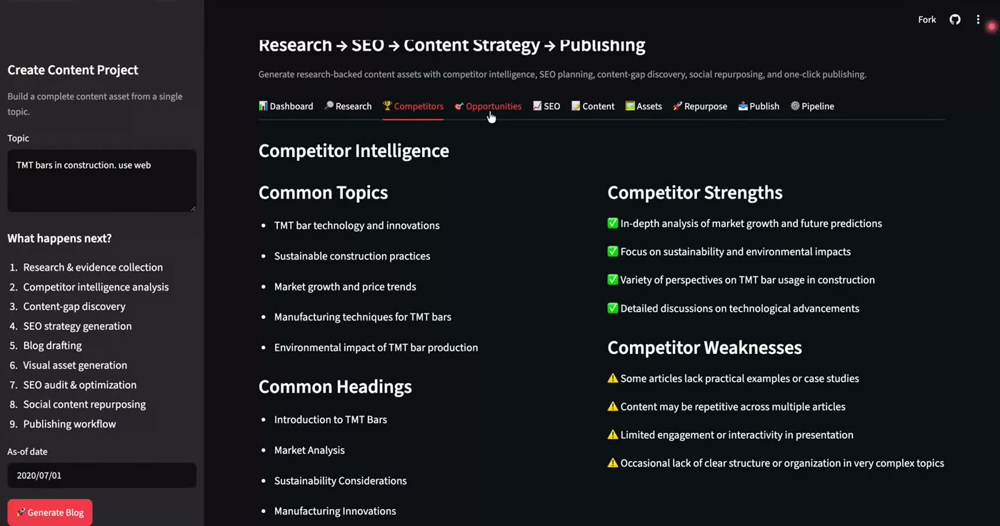 |
| **SEO audit and score**<br>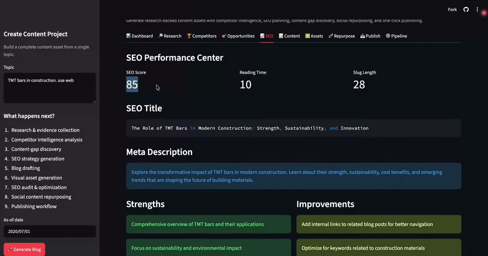 | **Generated article**<br>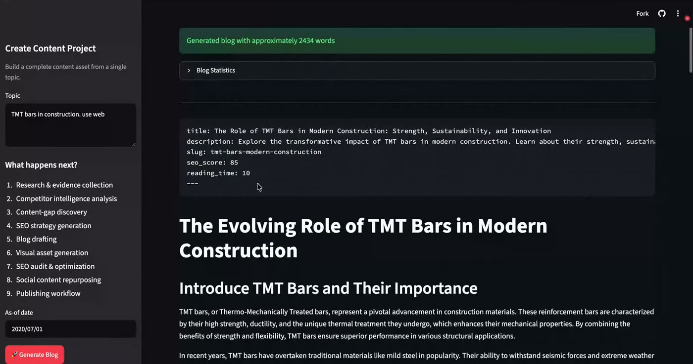 |
| **AI image planning**<br>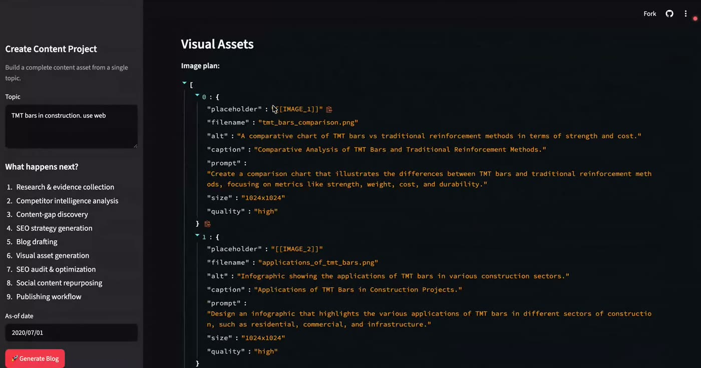 | **LinkedIn repurposing**<br>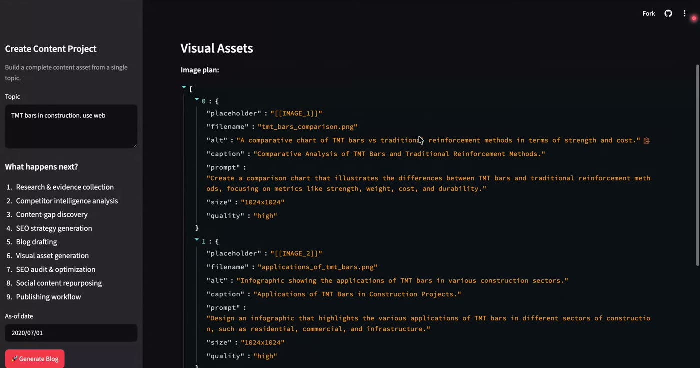 |
| **Twitter/X thread**<br>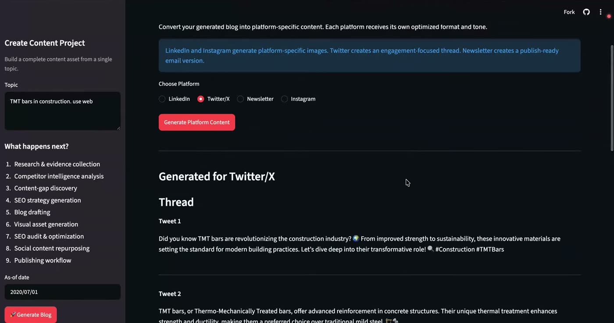 | **Published live on Dev.to**<br>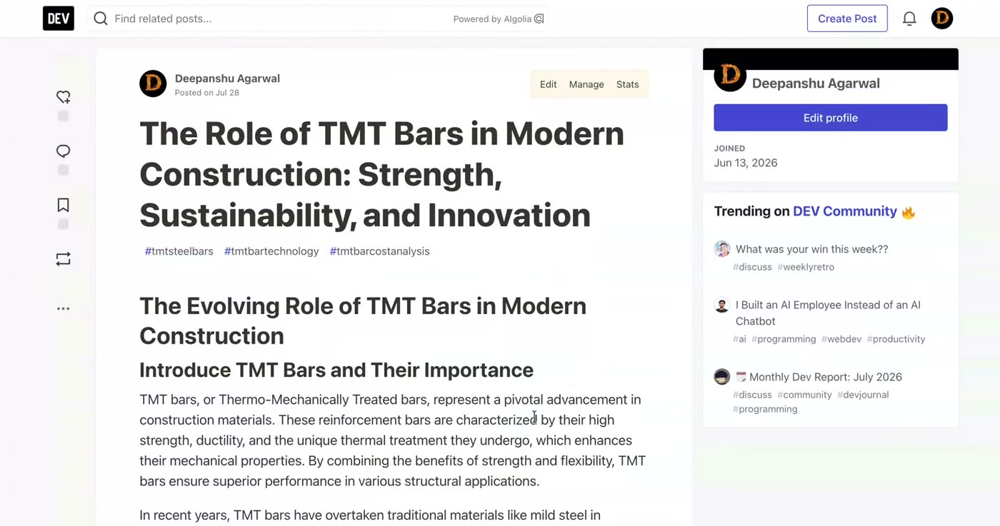 |

**Live pipeline monitor**: every agent's output streams into the UI as it runs.

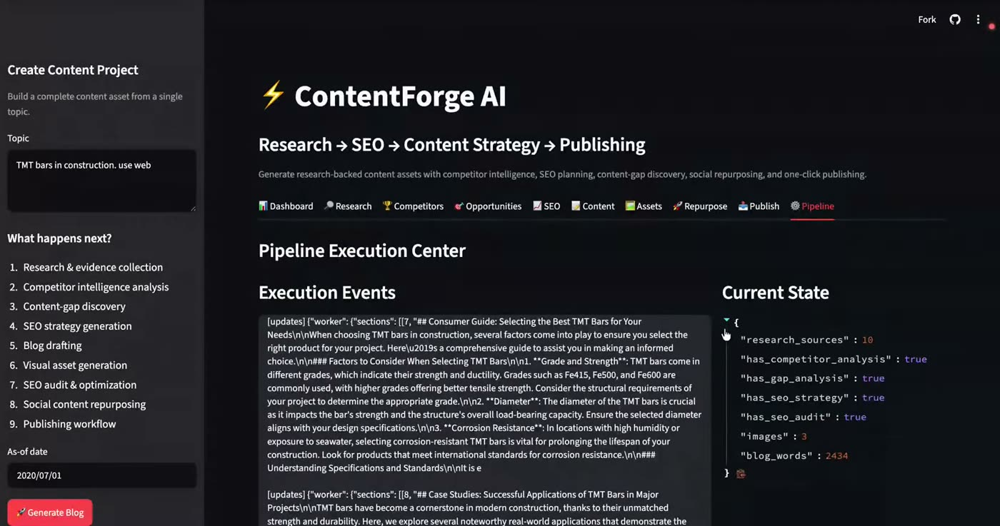

---

## 🏗️ How it works

The whole pipeline is a **LangGraph state machine**. Each agent is a node that reads from and writes to a shared, typed state. Every LLM call returns a **Pydantic-validated structured output** instead of free text, so each agent gets reliable input from the one before it.

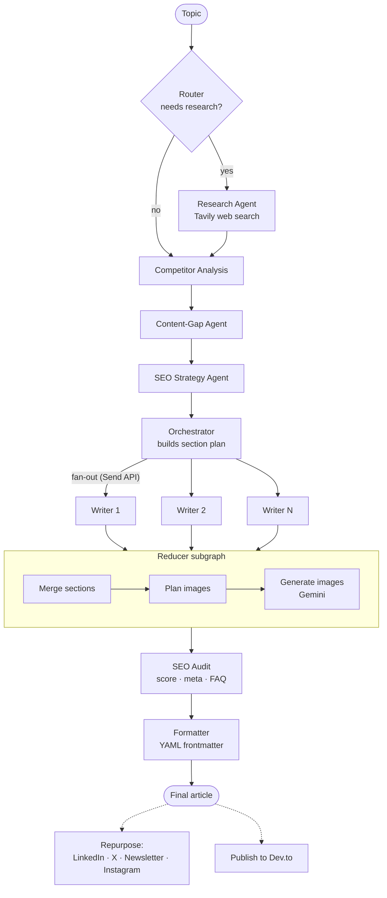

### Engineering highlights

- **Adaptive research depth.** The router picks one of three modes. *Closed-book* is for evergreen topics and skips search. *Hybrid* is for evergreen topics that need current examples and uses a 45-day recency window. *Open-book* is for news and "latest" topics and uses a 7-day window. That keeps API cost and latency down when fresh research isn't needed.
- **Parallel section writing.** The orchestrator fans out one worker per section with LangGraph's `Send` API, and the results are merged by a reducer. Total time is closer to the slowest section than to the sum of all sections.
- **Structured outputs everywhere.** Plans, evidence, competitor analysis, SEO strategy, and audits are Pydantic models (`Plan`, `EvidenceItem`, `SEOStrategy`, `SEOAudit`, …). Malformed LLM output fails validation right away instead of silently breaking the next step.
- **Image generation that can't crash the run.** If Gemini refuses a prompt, hits a quota, or times out, the article is still delivered without that image.
- **Grounded writing.** Writers get the research evidence and add `(Source)` links. The final article is scored by a separate auditor agent, not the one that wrote it.
- **Valid frontmatter.** Output starts with YAML frontmatter built with `yaml.safe_dump`, so titles like *"Agentic AI: A Guide"* don't break Dev.to or static-site generators.
- **One graph execution per run.** The UI streams `updates` (for live progress) and `values` (for final state) from a single `stream()` call, so the pipeline runs once instead of twice.
- **Observability.** Full LangSmith tracing of every agent call, for debugging prompts, latency, and token cost.

---

## 🧰 Tech stack

| Layer | Tools |
|---|---|
| Agent orchestration | **LangGraph** (state graph, conditional routing, `Send` fan-out, subgraphs) |
| LLM framework | **LangChain**, OpenAI **GPT-4o-mini**, Pydantic structured outputs |
| Web research | **Tavily Search API** |
| Image generation | **Google Gemini** (`google-genai`) |
| Publishing | **Dev.to (Forem) REST API** |
| Observability | **LangSmith** |
| Frontend and hosting | **Streamlit**, deployed on **Streamlit Community Cloud** |
| Dev environment | Dev Container (one-click GitHub Codespaces) |

---

## 🚀 Run it yourself

**Easiest:** open the [live app](https://contentforge-ai.streamlit.app/), or click **Code → Codespaces → Create codespace** on this repo. The dev container installs everything and starts the app.

**Locally:**

```bash
git clone https://github.com/deepanshu946/contentforge-ai.git
cd contentforge-ai

python -m venv venv
source venv/bin/activate          # Windows: venv\Scripts\activate
pip install -r requirements.txt

cp .env.example .env              # then add your API keys
streamlit run bwa_frontend.py
```

### API keys

| Variable | Needed for | Get it at |
|---|---|---|
| `OPENAI_API_KEY` | All agents (required) | platform.openai.com |
| `TAVILY_API_KEY` | Web research | tavily.com |
| `GOOGLE_API_KEY` | Image generation | aistudio.google.com |
| `LANGCHAIN_API_KEY` | LangSmith tracing (optional) | smith.langchain.com |

The Dev.to API key is entered in the app's **Publish** tab when you publish. It is never saved.

### Tests

```bash
python test_fixes.py
```

This checks that the generated frontmatter is valid YAML (including titles with colons) and that a run executes the agent graph exactly once.

---

## 📁 Project structure

```text
contentforge-ai/
├── bwa_backend.py        # LangGraph pipeline: every agent, Pydantic schemas, graph wiring
├── bwa_frontend.py       # Streamlit UI: 10 tabs, live pipeline streaming, downloads
├── publish_agent.py      # Dev.to publishing client
├── test_fixes.py         # Self-check for frontmatter and single-execution guarantees
├── blogs/                # Sample articles generated by the system
├── docs/screenshots/     # README images
├── .devcontainer/        # GitHub Codespaces setup
├── .env.example          # API key template
└── requirements.txt
```

Browse [`blogs/`](blogs/) for 17 real articles the system generated, on topics like agentic AI, CRISPR, quantum computing, and LangGraph.

---

## 🗺️ Roadmap

- [ ] Publish to WordPress, Medium, and Ghost
- [ ] Brand-voice memory, so articles match a company's writing style
- [ ] RAG over a company's own documents as a research source
- [ ] Content calendar and scheduled publishing
- [ ] Performance feedback loop that uses real traffic data to improve future posts

---

## 👋 About me

I'm **Deepanshu Agarwal**, an AI engineer who builds **agentic AI systems, LLM applications, and automation pipelines** with LangGraph, LangChain, OpenAI, and Gemini.

I built ContentForge AI end to end: the multi-agent architecture, the prompts and structured schemas, the Streamlit interface, the integrations (Tavily, Gemini, Dev.to, LangSmith), and the cloud deployment.

**I'm available for freelance work**, including:

- 🤖 AI agents and multi-agent workflows (LangGraph / LangChain)
- 💬 Chatbots and RAG systems over your own documents
- ⚙️ Content, marketing, and business-process automation with LLMs
- 🚀 Turning AI prototypes into deployed web apps

📧 **[deepanshuagarwal946@gmail.com](mailto:deepanshuagarwal946@gmail.com)** · 💻 **[github.com/deepanshu946](https://github.com/deepanshu946)**

If this project is useful or interesting, a ⭐ on the repo helps a lot.
